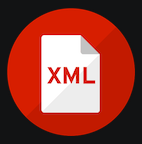

# Lenguaje de marcas UD1 

## Definiciones lenguajes de marcas

### Definiciones

Lenguaje de marcas: Organiza información mediante una sintaxis basada en marcas o etiquetas

### Tipos de lenguajs de marcas

|Tipo|Para qué sirve|Ejemplos|
|----|--------------|--------|
|Presentación|Muestra contenido formateado|*HTML*,*CSS*|
|Descriptivo|Intercambio de información|*XML*,*JSON*|
|Documentación|Documentar proyectos|*Markdown*,*LaTex*|

## Instalación y configuración del entorno de trabajo

1. Instalar [VS Code](https://code.visualstudio.com/)
2. Instalar plugins
   - [HTML CSS Support](https://marketplace.visualstudio.com/items?itemName=ecmel.vscode-html-css)
   - [Live Preview](https://marketplace.visualstudio.com/items?itemName=ms-vscode.live-server)
   - [Markdown All in One](https://marketplace.visualstudio.com/items?itemName=yzhang.markdown-all-in-one)
   - [XML-Red Hat](https://marketplace.visualstudio.com/items?itemName=redhat.vscode-xml)
3. Instalar git
```bash
sudo apt install git 
```
4. Crear repositorio añadir código y hacer commit

## Plugins instalados

|Nombre|Imagen|Uso|
|------|------|---|
|**HTML CSS Support**||Ayuda con sintaxis y autocompletado CSS|
|**Live Preview**||Visualizar presentación de HTML|
|**Markdown All in One**||Visualizar presentación de Markdown|
|**XML - Red Hat**||Ayuda con sintaxis y autocompletado XML|  
